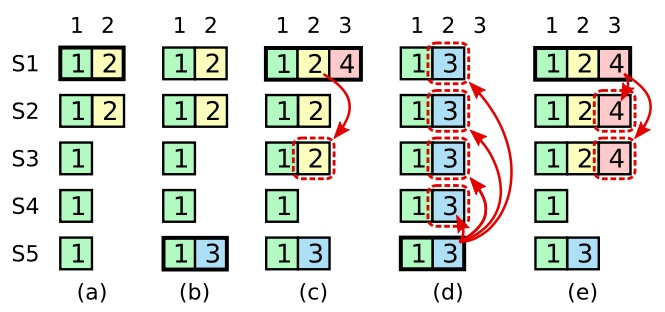

# Raft 精简总结

# 1. 目标

在多节点间选出唯一Leader，由Leader统一接收并同步日志，保证所有节点按相同顺序执行执行相同指令，从而实现分布式系统的强一致性和高可用性，让分布式集群像单机一样可靠运行。

# 2. 核心机制

## 2.1. Leader Election

### 2.1.1. 触发条件

Follower/Candidate在选举超时时间内未收到来自Leader的heartbeat。

### 2.1.2. 流程

- 若当前节点选举超时，Follower → Candidate，Candidate → Candidate，term++并重置选举超时时间
- 每个Candidate都会给自己投票，然后发RequestVote RPC给别的节点请求投票
- 获得所有节点（包括无法服务的节点）中过半的票数，成为Leader
- 收到更大的term，退回Follower

### 2.1.3. 约束

- 每个节点在每个term内只能投一票（Election Safety）
- 每个节点在投票的时候会投给日志不比自己的旧的Candidate（保证Leader Completeness）

---

## 2.2. Log Replication

### 2.2.1 触发条件

Leader接收客户端请求或发送心跳给别的节点时。

### 2.2.2 流程

- Leader将客户端请求中携带的操作追加到自己的本地日志
- 发送AppendEntries RPC给别的节点，携带prevLog信息
- Follower进行校验
    - Follower 在 prevLogIndex 处是否存在日志，并且 term == prevLogTerm，是就追加日志
    - 不匹配的话，就拒绝追加日志并返回ConflictIndex和ConflictTerm
- Leader根据返回的信息更新nextIndex和matchIndex，在收到更大term的时候会降级成Follower

### 2.2.3 约束

- PrevLogIndex和PrevLogTerm保证日志的一致性
- 在日志出现分叉的时候，Follower的冲突日志会被Leader的日志覆盖（Log Matching）

---

## 2.3 Commit

### 2.3.1. 触发条件

Leader收到来自Follower的日志追加成功的信息。

### 2.3.2 流程

- Leader根据matchIndex找到一个N，过半节点的日志长度都大于等于N
- 更新commitIndex，并立刻通知各Follower开始复制，以便尽快提交日志
- Follower在日志追加成功后会更新自己的commitIndex

### 2.3.3. 约束

- 只有log[N].term == currentTerm时才能提交
- 防止旧Leader的日志条目被提交（Leader Completeness）

# 3. Commit规则详解

按核心机制中所说的那样，可以将日志提交的规则总结成下面两点：

```
存在一个N满足：
1. 过半matchIndex >= N
2. log[N].term == currentTerm
```

Q：为什么一定要满足第二条条件？

A：**leader 不能仅凭多数派复制来直接提交旧 term 的日志**，因为旧 term 的日志即使在多数节点上存在，也可能在某些 Figure 8 场景中被未来 leader 覆盖。当前 term 的日志提交后，才会顺带保证它之前的日志也安全。



# 4. 不变量

## 4.1. Election Safety

**一个term内只能有一个Leader。**

如果因为分区等问题产生了新Leader，那么旧的Leader就会在收到新Leader的heartbeat或收到来自Follower对其heartbeat的反馈时降级成为Follower。

Leader Election时的投票规则保证了这个不变量。在投票的时候为了避免出现大量Follower同时开始请求投票，然后每个Follower的获票量不足，导致在投票阶段停留过久的问题，Raft采用了随机选举超时的方法来解决。

每个节点都有一个一定范围内的随机的选举超时时间，大概率情况下一个时间段内只有少数节点会超时并开始请求投票，Follower投完票后会重置其选举超市时间，这样就可以降低上述问题发生的概率。

---

## 4.2. Log Matching

**只要两条日志在相同index上具有相同term，那么它们及它们之前的所有日志完全一致。**

这是由Raft的两条规则保证的：

1. Leader在一个term内，只会给某个index写一次日志
2. Leader的日志只会追加，不会修改或覆盖前面的日志

这个不变量可以简化Raft的日志同步，Raft只需将index和term告诉Follower，Follower就可以判断自己的历史日志是否与Leader一致，一致的话直接从这条日志条目的下一个index开始同步日志。

---

## 4.3. Leader Completeness

**已经提交的日志一定会存在于未来的Leader的日志中。**

在投票的时候，Follower会投票给日志不比自己旧的Candidate，判断的标准是：如果Candidate日志的最后一条的term大于自己的，那么就投票给它；如果相同就看日志的长度，Candidate的日志长度比Follower的大于等于的话就会投票给这个Candidate。再加上Commit规则，就保证了任何当选的新Leader，一定包含所有已提交的日志。

---

## 4.4. State Machine Safety

**如果某一个节点已经将给定index处的日志条目应用至其状态机中，则其他任何节点在该index处都不会应用不同的日志条目。**

这是因为能被状态机应用的日志条目都是已经提交的日志条目，这些日志条目会由Leader传递给Follower，Follower冲突的部分会直接被Leader的日志覆盖掉，这样到最后所有Follower在相同index都会有相同的已提交的那条日志，从而保证状态机中应用的日志条目都一致，这正好是Raft保证的强一致性。

# 5. 与KV的关系

```
Client → Leader → Raft log → commit → apply → 状态机

1. Raft 保证顺序一致
2. KV 执行命令
3. 通过 clientID + requestID 保证幂等
```

# 6. Persistence

## 6.1. 目标

Raft 必须在节点崩溃重启后仍然保持安全性。只要已经做出的投票、term 变化和日志写入丢失，就可能导致一个节点在同一 term 内重复投票，或者丢失已经参与复制的日志，从而破坏一致性。

---

## 6.2. 需要持久化的状态

1. currentTerm
2. votedFor
3. log[]
4. snapshot 相关状态：lastIncludedIndex、lastIncludedTerm

---

## 6.3. 约束

这些状态必须在对外可见前持久化。例如：节点更新 currentTerm、投票给某个 Candidate、追加日志、截断日志生成 snapshot 时，都应该先保存到持久化存储中。

commitIndex 和 lastApplied 通常不需要持久化，因为它们可以在重启后通过 leader 的 AppendEntries 和本地日志重新推进。

# 7. Apply 机制

## 7.1. 核心变量

commitIndex：表示已经被 Raft 确认提交的最大日志 index。

lastApplied：表示已经交给上层状态机执行的最大日志 index。

---

## 7.2. 流程

1. Leader 在确认某个日志被过半节点复制后，推进 commitIndex。
2. Follower 收到 Leader 的 AppendEntries 后，根据 leaderCommit 更新自己的 commitIndex。
3. 每个节点后台检查：如果 commitIndex > lastApplied，就按顺序将日志从 lastApplied + 1 应用到状态机。

---

## 7.3. 约束

Raft 只保证所有节点以相同顺序 apply 相同日志。

具体命令怎么执行、是否幂等、结果怎么返回给客户端，是上层状态机负责的事情。

# 8. Snapshot / InstallSnapshot

## 8.1. 目标

如果 Raft 日志无限增长，重启恢复和日志复制都会越来越慢。Snapshot 用来压缩已经 apply 的历史日志，只保留状态机快照和快照之后的新日志。

---

## 8.2. 本地 Snapshot 流程

上层状态机在某个 index 已经 apply 后，可以把当前状态编码成 snapshot。

Raft 收到 snapshot 后：

1. 删除 index 之前的旧日志
2. 记录 lastIncludedIndex 和 lastIncludedTerm
3. 将 Raft 状态和 snapshot 一起持久化

---

## 8.3. InstallSnapshot 流程

如果某个 Follower 落后太多，Leader 已经没有它需要的旧日志，就不能继续用 AppendEntries 补日志。

此时 Leader 发送 InstallSnapshot RPC。

Follower 收到后：

1. 如果 snapshot 比自己已有状态旧，直接忽略
2. 否则安装 snapshot
3. 更新 lastIncludedIndex / lastIncludedTerm
4. 丢弃 snapshot 覆盖范围内的旧日志
5. 将 snapshot 交给上层状态机恢复

---

## 8.4. 约束

Snapshot 只能覆盖已经提交并 apply 的日志。

Raft 状态和 snapshot 必须原子保存，避免出现 Raft 日志已经截断但状态机 snapshot 丢失的情况。

# 9. 客户端语义

## 9.1. Raft 保证什么

Raft 保证的是日志一致性：

1. 多个节点最终以相同顺序看到相同日志
2. 已提交日志不会被未来 Leader 覆盖
3. 状态机按日志顺序执行命令

---

## 9.2. Raft 不保证什么

Raft 本身不保证客户端请求只执行一次。

如果 Leader 提交了命令，但回复客户端前崩溃，客户端会重试。新 Leader 可能再次收到同一个请求。

---

## 9.3. 上层需要做什么

上层 KV 服务需要使用：clientID + requestID 来识别重复请求。如果发现请求已经执行过，就直接返回上次结果，而不是再次执行命令。

因此：

Raft 保证命令顺序一致；
KV 层保证客户端请求幂等。

# 10. Raft 库化边界

## 10.1. Raft Core

Raft Core 只负责共识逻辑：

1. Leader Election
2. Log Replication
3. Commit
4. Apply
5. Persistence
6. Snapshot

Raft Core 不应该关心具体网络实现，也不应该关心上层命令的业务含义。

---

## 10.2. Transport

Transport 负责节点之间怎么通信。

Raft Core 只需要表达：

1. 发送 RequestVote
2. 发送 AppendEntries
3. 发送 InstallSnapshot

底层可以是内存网络、gRPC、TCP 或其他 RPC 实现。

---

## 10.3. Storage

Storage 负责持久化 Raft 状态和 snapshot。

Raft Core 只需要接口：

1. SaveState
2. SaveStateAndSnapshot
3. ReadState
4. ReadSnapshot

具体可以是内存、文件、WAL 或嵌入式数据库。

---

## 10.4. State Machine

State Machine 是 Raft 的上层使用者。

Raft 提交日志后，通过 apply channel 把命令交给 State Machine。

State Machine 负责真正执行命令，例如 KV 的 Put、Append、Get，以及客户端去重。

# 11. 总结

Raft的本质是让一组节点通过选举建立稳定的Leader，由Leader串行操作，负责统一复制与提交日志，并结合过半复制的要求，保证日志顺序不会回滚。